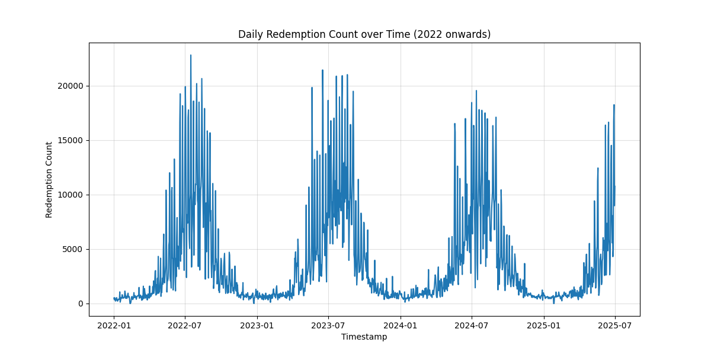
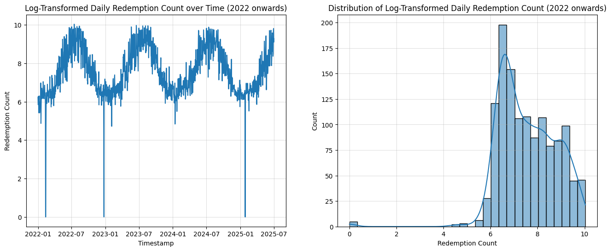
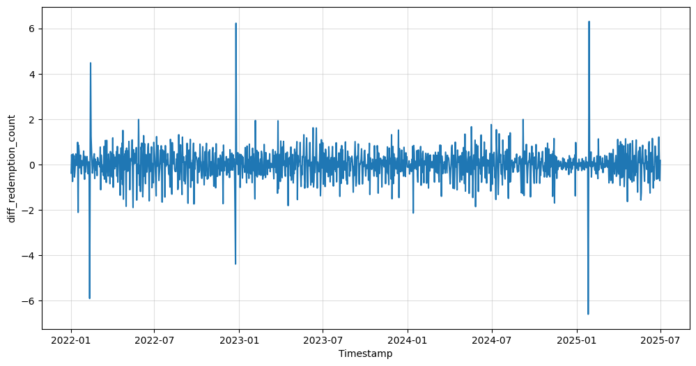
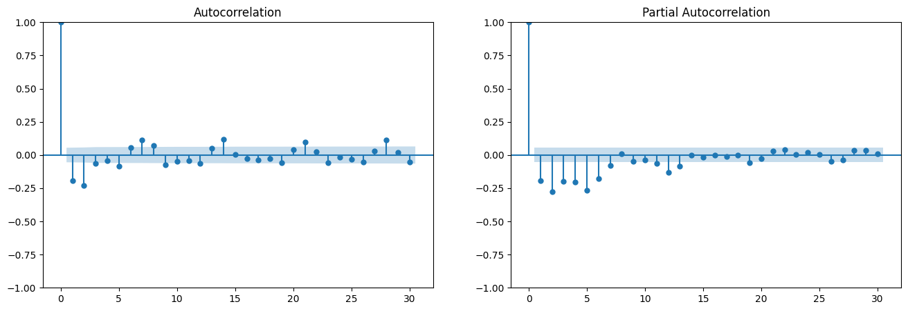
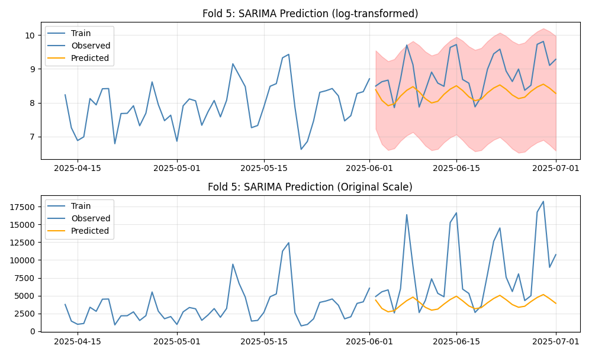
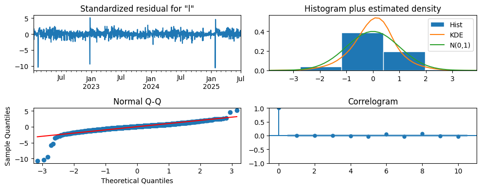
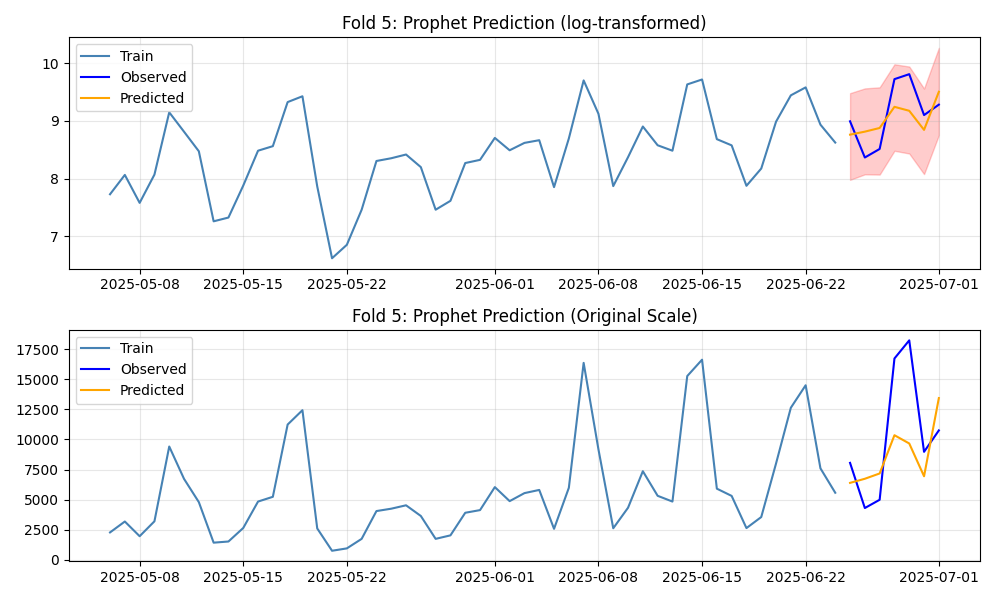
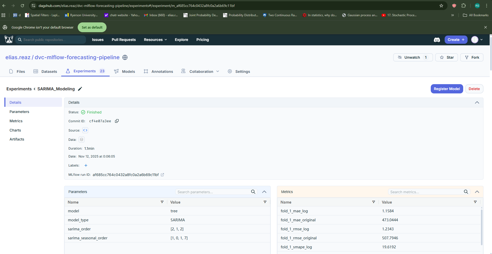

## Toronto Ferry Ticket Sales Forecasting using SARIMA, Prophet: along with DVC and Mlflow

This project demonstrates a complete time series forecasting workflow using SARIMA and Prophet. It includes preprocessing, exploratory analysis, model fitting, and forecasting for a 30-day horizon. The pipeline is modular, reproducible, and designed for extensibility.

## Project structure

```text
sarima-prophet-mlflow-dvc-pipeline/
├── .dvc/                                         # DVC configuration
├── .venv/                                        # Virtual environment
├── data/
│   ├── raw/
│   │   └── TorontoIslandFerryTicketCount.csv
│   └── processed/
│       └── daily_tickets_2022_25.parquet
├── models/
│   ├── sarima_model.pkl
│   └── prophet_model.pkl
├── notebooks/
│   ├── exploratory_analysis.ipynb
│   ├── sarima_exploration.ipynb
│   └── prophet_exploration.ipynb
├── output/
│   ├── plots/
│   └── results/
│       ├── sarima_cv_results.csv
│       └── prophet_cv_results.csv
├── scripts/
│   ├── __init__.py
│   ├── sarima_model.py
│   └── prophet_model.py
├── utils/
│   ├── __init__.py
│   ├── evaluate_forecast.py
│   └── mlflow_logger.py
├── .env
├── requirements.txt
└── README.md
```
### Toronto Ferry Ticket Sales Redemption Data



*Figure: Daily redemption count from 2022 onwards.*
- We observe yearly seasonality - winter low and summer high 
- There is also weekly seasonality - weekend high
- Presence of sudden spikes are visible

### Basic Statistics 

* The mean ticket count is approximately 3,700, while the median (50th percentile) is around 1,600, indicating a right-skewed distribution. This suggests that a few extreme high values are pulling the mean above the median.

* A high standard deviation of 4,440 tickets reflects a wide dispersion in daily ticket sales, pointing to substantial variability across days. 

### Log-transformation for variance stability and first-difference to remove trend and make the series stationary


*Figure: log-transformed daily redemption stabilizes the variance.

### First differencing of log-transformed series

*Figure: We see that the series mean is zero, with almost stable variance and sudden spikes*

### One-step differencing of log-transformed time-series

* Log transformation stabilizes the variance and reduce the impact of spikes

* one-step differencing now removes the trend, making the time-series stationary. 

* one-step differencing represents the relative changes or growth rate in redemption counts from one day to the next.

* it centers around zero with occasional spkies and dips

### ACF and PACF plots


### Auto-correlation and Partial Auto-correlation of 1-step differencing of log-transformed time series

* PACF suggests significant auto-correlation at lag 1, 2, 3, 4, 5 and 6. After that the correlation dies. We can try with AR(p) p from 1 to 6 and see the BIC

* ACF suggests signification relationships at lag 1 and 2. q could be 1 or 12

### Augmented Dickey-Fuller test

```python
from statsmodels.tsa.stattools import adfuller
import pandas as pd

# Run the test
result = adfuller(data_diff['diff_redemption_count'].dropna())

# Organize results
adf_output = {
    'ADF Statistic': result[0],
    'p-value': result[1],
    'Number of Lags Used': result[2],
    'Number of Observations Used': result[3],
    'Critical Values': result[4],
    'IC Best (AIC)': result[5]
}

# Display as DataFrame
adf_df = pd.DataFrame.from_dict(adf_output, orient='index', columns=['Value'])
print(adf_df)
```
```
                                                                         Value
ADF Statistic                                                       -16.285116
p-value                                                                    0.0
Number of Lags Used                                                         12
Number of Observations Used                                               1264
Critical Values                                 {'1%': -3.4355, '5%': -2.8638}
IC Best (AIC)                                                      2274.831503
```

* p-value = 0 suggestes that the data does not provide enough evidence in favor of the null hypothesis that the time series has a unit root - the series is non-staionary.

* So we reject the Null Hypothesis that the series is non-stationary. 

* 1-step differencing of log-transformation has made the seties stationary.

### Apply SARIMA (2,1,2)$\times$ (1,0,1,7) model on log-transformed redemption tickets

```python
sarima_model = SARIMAX(
    y,
    order=(2,1,2),
    seasonal_order=(1,0,1,7),
    enforce_stationarity=False,
    enforce_invertibility=False
)
final_res = sarima_model.fit(disp=False)

forecast_steps = 30 # 7
future_index = pd.date_range(start=y.index[-1] + pd.Timedelta(days=1), periods=forecast_steps, freq='D')
forecast = final_res.forecast(steps=forecast_steps)
forecasted_object = final_res.get_forecast(steps=forecast_steps)
mean_forecast = forecasted_object.predicted_mean
confint = forecasted_object.conf_int()

forecast = pd.Series(forecast, index=future_index)

```
<!-- 
### forecast over 30 days
 -->



- Residuals are approximately normal, but not perfect. Mild departure from normality, especially in the extremes. This is acceptable for forecasting, though you might consider a robustness check if prediction intervals are critical.

- The spike at lag 1 (Correlogram) suggests some autocorrelation remains, which means the model might be slightly underfitting short-term dynamics.

- SARIMA(2,1,2)(1,0,1,7) model is reasonably well-specified.

### Prophet Modeling with TimeSeriesSplit Cross-Validation

```python
    # TimeSeriesSplit with 7-day test windows to simulate weekly forecasting
    tscv = TimeSeriesSplit(n_splits=n_splits, test_size=forecast_horizon)

    for fold, (train_idx, test_idx) in enumerate(tscv.split(df)):
        
        train_df = df.iloc[train_idx]
        test_df = df.iloc[test_idx]

        model = Prophet(
            growth='linear',
            yearly_seasonality=True,
            weekly_seasonality=True,
            daily_seasonality=False,
            holidays=holiday_df
        )
        model.fit(train_df)

        future = model.make_future_dataframe(periods=len(test_df), freq='D')
        forecast = model.predict(future)
        # forecast_test = forecast.set_index('ds').loc[test_df['ds'].values]
        forecast_test = forecast.set_index('ds').reindex(test_df['ds'])

        evaluation_metric_dict = evaluate_forecast(test_df['y'], forecast_test['yhat'])

```


### comparison 30-day forecast

A comparison table below showing **SARIMA vs Prophet** on original scale metrics, with **% improvement** of Prophet over SARIMA for each fold:

### 📊 Fold-wise Comparison with % Improvement

| Fold | SARIMA MAE | Prophet MAE | % MAE ↓ | SARIMA RMSE | Prophet RMSE | % RMSE ↓ | SARIMA SMAPE | Prophet SMAPE | % SMAPE ↓ |
|------|------------|-------------|---------|--------------|---------------|-----------|----------------|----------------|-------------|
| **1** | 473.04 | 213.04 | **54.98%** | 507.79 | 246.57 | **51.44%** | 101.30 | 33.55 | **66.88%** |
| **2** | 265.57 | 267.11 | **-0.58%** | 322.59 | 371.62 | **-15.20%** | 31.37 | 30.14 | **3.89%** |
| **3** | 1273.46 | 819.95 | **35.61%** | 1770.19 | 1164.53 | **34.23%** | 72.41 | 41.31 | **42.94%** |
| **4** | 1984.88 | 1531.90 | **22.78%** | 3091.61 | 2152.43 | **30.37%** | 50.77 | 41.67 | **17.91%** |
| **5** | 4368.85 | 3167.34 | **27.47%** | 5954.60 | 4324.06 | **27.42%** | 59.20 | 39.96 | **32.52%** |

> **% Improvement = ((SARIMA − Prophet) / SARIMA) × 100**

### Aggregated Summary (Mean across folds)

| Metric | SARIMA | Prophet | % Improvement |
|--------|--------|---------|----------------|
| **MAE** | 1873.16 | 1199.47 | **35.95%** |
| **RMSE** | 2329.76 | 1251.85 | **46.27%** |
| **SMAPE** | 62.81 | 37.33 | **40.58%** |

### Insights

- Prophet consistently outperforms SARIMA in Fold 1, 3, 4, and 5, with substantial gains in SMAPE and RMSE.
- Fold 2 is an anomaly where SARIMA slightly edges Prophet in MAE and RMSE.
- Prophet achieves ~36% lower MAE, ~46% lower RMSE, and ~41% lower SMAPE on average. If you're selecting a model for forecasting, Prophet appears to generalize better across varied error metrics.

- Overall, **Prophet** shows **stronger generalization** capturinng both trend and seasonality and **lower error** across all metrics.

### MLflow Integration with DagsHub


This project uses MLflow for experiment tracking, model management, and reproducibility, fully integrated with DagsHub's hosted MLflow server.



https://dagshub.com/elias.reaz/dvc-mlflow-forecasting-pipeline/experiments

